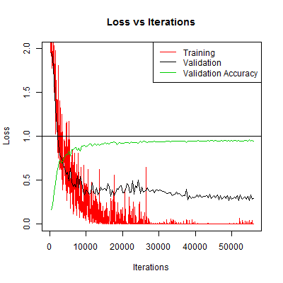

EmotionNet
=

Important Notice 
==
This project was built upon for a second version and this version is no longer maintained. The new version has been released and generalizes better than this version. I've been made aware that this version requires a little bit of undocumented work to get working.

The new [EmotionNet2](https://github.com/co60ca/EmotionNet2).

What is EmotionNet?
-

Co-opted project by [Maeve Kennedy](https://github.com/co60ca)([@co60ca](https://twitter.com/co60ca)) and [Adam Balint](https://github.com/AdamBalint)

EmotionNet is an application of Convolutional Neural Networks to emotion recognition in photographs of human faces. It is willing to accept any photo of an image but has mixed results on photos that are not well composed. It contains build scripts for creating training data and a service for classifying the emotions on a webserver with PHP support and a python service for interfacing with the performance code.

Well how does it perform?
-
Extremely well actually. On validation data using an 80%/20% split we are able to train the model to 95% accuracy. We suggest that the performance of the model would only increase with the introduction of additional training data. Automatic collection of training data occurs within our feedback features.

Here is a plot of training/validation loss and validation accuracy  

Examples
-
Here are some interesting and funny examples of the webservice and output classification of each image.

Example including interface:

* 93.43% Contempt
* 5.03% Anger

* 99.99% Surprised

* 68.66% Disgust
* 27.98% Fear

Prerequisite
-
Preface: There are a lot of prerequisite tools and applications required to utilize the EmotionNet, these prerequisite will likely require you to make modifications to the source files depending on how your particular selection of tools works.  
For reference we used a Arch Linux system with `caffe-git` from the [AUR](https://aur.archlinux.org/packages/caffe-git/) for our high performance/training system(Using GPU acceleration). For our webservice side we used a Ubuntu 15.04 on QEMU+KVM for portability. We suggest using Ubuntu 14.04 LTS as suggested by [the caffe team](http://caffe.berkeleyvision.org/install_apt.html) since there are several issues with caffe on 15.04 that are not worth the hassle.

* GNU/Linux host capable of using caffe (Ubuntu 14.04 LTS suggested)
	* GPU supporting CUDA suggested
* php/apache
* [caffe](http://caffe.berkeleyvision.org/)
* python2.7+
	* numpy
* [flask](http://flask.pocoo.org/)
* Datasets as per below

A complete EmotionNet will contain a

1. `.caffemodel` which contains the weights of the model.
2. Solver prototxt(s)
3. Model prototxt(s)

Datasets
-
Datasets are not included in this repo since git is not adequately suited for large file storage and due to the re-distribution terms of use of the copyright holders. This is typical.

In order to train the EmotionNet you will need at least one of the following datasets:

* [Cohn-Kanade (CK+) dataset](http://www.consortium.ri.cmu.edu/ckagree/)
* [Karolinska Directed Emotional Faces (KDEF)](http://www.emotionlab.se/resources/kdef)

Running
-

First we must build the databases used for the model. Run `build-scripts/00-run-all.sh` to caffeinate the data from the datasets. The datasets should be in `datasets/`with the following structure.

* `datasets/`
	* `cohn-kanade-images/` (Extracted from the CK+ dataset)
	* `Emotion/` (Extracted from the CK+ dataset)
	* `KDEF/` (From KDEF dataset)

A script `run-scripts/model-runner.sh` was written to simplify the logging of the performance of the model. Simply run

`run-scripts/model-runner.sh <solver file> <log prefix name>`

The model should run for about 12 hours on a recent mid-range GPU, most of the performance comes from the first 10,000 iterations.

To test the model, either use the runner class directly or use the PHP/flask interface. The webroot is in `http/` and the flask service is in `py/flaskr/flaskr` which has a convenience script for starting in `./run-flask-server.sh` You may need to specify your $CAFFEROOT in the script above.
